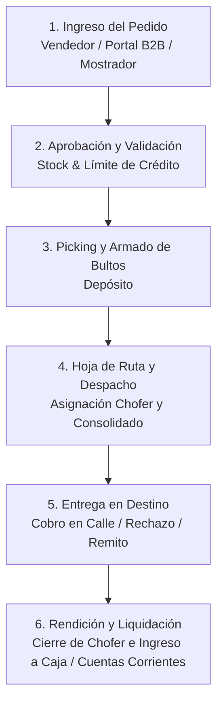

# ONLYERP — MANUAL OPERATIVO Y CICLO DE VIDA DE PROCESOS
**Guía Integral para Operadores, Vendedores, Depósito, Logística y Administración**

Este documento describe el flujo operativo estándar de **OnlyERP**. Cualquier persona incorporada al equipo operativo, comercial o administrativo debe seguir estos procedimientos paso a paso para garantizar precisión en el stock, trazabilidad en los envíos y cuadre exacto de la caja y cuentas corrientes.

---



---

## 1. CICLO DE VIDA DE LOS PEDIDOS

### 1.1 Canales de Ingreso
Los pedidos pueden entrar al sistema por 3 vías:
1. **Preventa / Vendedores de Calle**: Vía panel `/vendedor` desde el celular o tablet.
2. **Portal B2B Mayorista**: Vía `/portal-b2b` donde los clientes mayoristas cargan su propio pedido.
3. **Carga en Mostrador / Administración**: Vía `/pedidos` o `/presupuestos`.

---

### 1.2 Estados del Pedido y Flujo Operativo

| Estado | Significado | ¿Quién actúa? | Acción requerida |
| :--- | :--- | :--- | :--- |
| **`PENDIENTE`** | Pedido recién ingresado. | **Administración / Ventas** | Revisar cantidades, bonificaciones aplicadas y situación crediticia del cliente. |
| **`APROBADO`** | Pedido validado comercialmente. | **Administración** | Al hacer clic en **"Aprobar"**, el sistema descuenta/reserva el stock y el pedido viaja automáticamente a la cola de preparación de depósito. |
| **`ARMADO`** | Mercadería embalada y lista. | **Encargado de Depósito** | Realiza el picking con la lista de bultos, embala y marca el pedido como **"Armado"**. El pedido queda listo para logística. |
| **`EN_HOJA_DE_RUTA`** | Asignado a un vehículo/chofer. | **Logística** | El pedido se incluye en una Hoja de Ruta de despacho. |
| **`ENTREGADO`** | Recibido por el cliente. | **Chofer / Repartidor** | El chofer confirma la entrega y registra cómo cobró (Efectivo, Cheque, Transferencia o Deuda a Cuenta Corriente). |
| **`RECHAZADO` / `PARCIAL`** | Cliente no recibió o devolvió ítems. | **Chofer y Depósito** | La mercadería no entregada reingresa automáticamente al stock físico del depósito tras la rendición. |
| **`FACTURADO`** | Proceso completado. | **Administración** | Se emite la Factura Electrónica (AFIP) o Comprobante Interno definitivo. |

---

## 2. LOGÍSTICA, HOJAS DE RUTA Y REPARTO

La logística conecta los pedidos armados en depósito con la entrega física y el cobro en el domicilio del cliente.

---

### 2.1 Paso a Paso: Armado y Despacho de Hoja de Ruta

1. **Creación de la Ruta (`/logistica/hojas-de-ruta`)**:
   - El responsable de logística hace clic en **"Nueva Hoja de Ruta"**.
   - Selecciona el **Repartidor / Chofer** asignado y el vehículo.
   - El sistema lista todos los pedidos en estado **`ARMADO`**.
   - Se seleccionan los pedidos de la zona o recorrido y se confirma la creación.

2. **Impresión del Consolidado de Carga para Depósito**:
   - En la Hoja de Ruta, hacer clic en **"Imprimir Consolidado de Carga"**.
   - Este documento agrupa **el total de productos de todos los pedidos sumados** (ej. *Total: 45 cajas de Aceite, 20 bultos de Arroz*).
   - Depósito usa este consolidado para cargar el camión rápidamente sin revisar pedido por pedido.

3. **Impresión de la Hoja de Ruta para el Chofer**:
   - Se imprime la **Hoja de Ruta de Reparto** (orden de entregas, direcciones, teléfonos, método de cobro esperado y montos).
   - Se entregan los remitos/facturas correspondientes a cada cliente.

---

### 2.2 Entrega en Calle y Rendición del Chofer

1. **Cobranzas en Mano del Chofer**:
   - El repartidor puede recibir pagos en:
     - **Efectivo**
     - **Cheques físicos / eCheqs** (registrando Banco, N° y Vencimiento)
     - **Transferencias bancarias** (solicitando comprobante)
     - **Abono a Cuenta Corriente** (si el cliente tiene saldo crediticio autorizado)
2. **Cierre y Rendición en Administración (`/logistica/rendicion/[id]`)**:
   - Al regresar a la base, el chofer se presenta ante Administración/Caja.
   - El operador abre la pantalla de **Rendición de Hoja de Ruta**.
   - Por cada pedido se marca:
     - Si fue **Entregado Total**, **Entregado Parcial** o **Rechazado**.
     - El desglose exacto de valores cobrados (Efectivo, Cheques, etc.).
   - Al confirmar la rendición:
     - **Efectivo recaudado**: Ingresa automáticamente a la **Caja Diaria activa** con el concepto `COBRANZA_REPARTO`.
     - **Cheques**: Se ingresan automáticamente a la **Cartera de Valores**.
     - **Rechazos**: Las unidades devueltas reingresan de inmediato al stock del depósito sin intervención manual.

---

## 3. GESTIÓN DE CUENTAS CORRIENTES (DEUDORES)

El módulo de Cuentas Corrientes (`/cuentas-corrientes`) gestiona el crédito otorgado a clientes de confianza y asegura la recuperación del dinero en tiempo y forma.

---

### 3.1 Otorgamiento de Crédito y Límites
- A cada cliente se le configura en su ficha (`/clientes`):
  - **Límite de Crédito en Pesos**: Monto máximo de deuda permitido (ej. `$500.000`).
  - **Días de Vencimiento de Factura**: Plazo habitual de pago (ej. *7 días*, *15 días*, *30 días*).
  - **Límite de Descuento Permitido**: Para evitar bonificaciones excesivas de vendedores.
- **Control Automático**: Si un cliente supera su límite de crédito o tiene facturas vencidas impagas, el sistema alerta y bloquea nuevas ventas a cuenta corriente salvo autorización de un usuario Administrador.

---

### 3.2 Registro de Cobranzas / Abonos (`/cuentas-corrientes`)

1. **Buscar al Cliente** en el directorio de deudores.
2. Hacer clic en **"Ver Ficha"**:
   - Se visualizan las facturas pendientes de cobro y el historial de pagos.
3. Hacer clic en **"Registrar Pago / Abono"**:
   - **Monto Cobrado**: Se indica el importe recibido.
   - **Método de Pago**: Efectivo, Transferencia, Cheque o Tarjeta.
   - **Descuento por Pronto Pago (Opcional)**: Si el cliente cancela antes de término, se puede aplicar un descuento (ej. *5%*). El sistema reduce el 100% de la deuda en la factura pero ingresa a caja únicamente el efectivo real recibido.
4. **Impacto Financiero Inmediato**:
   - El saldo pendiente de la factura disminuye.
   - Si la deuda llega a $0, la factura pasa automáticamente a **`PAGADO`**.
   - El dinero entra instantáneamente a la **Caja Diaria abierta**.
   - Se genera el recibo de cobro con numeración y fecha para el cliente.

---

### 3.3 Cheques Rechazados y Reapertura de Deuda
Si un cheque entregado por un cliente viene rechazado por el banco (falta de fondos, etc.):
1. Ir a **Finanzas** -> **Cartera de Valores** (`/finanzas/cartera-valores`).
2. Buscar el cheque y presionar **"Marcar Rechazado"**, indicando el motivo.
3. **Acción Automática del Sistema**:
   - El cheque cambia su estado a `RECHAZADO`.
   - Se genera de inmediato un **`CARGO`** en la Cuenta Corriente del cliente por el valor del cheque, reabriendo la deuda automáticamente con el detalle del banco y número de cheque devuelto.

---

### 3.4 Recálculo de Deuda por Inflación (Facturas Vencidas)
En contextos inflacionarios, cuando un cliente adeuda una factura vencida hace meses:
1. En la ficha del cliente, sobre la factura vencida, hacer clic en **"Recalcular por Inflación"**.
2. El sistema toma los productos de esa venta, lee los costos y márgenes vigentes **al día de hoy**, actualiza los precios unitarios y ajusta el saldo adeudado respetando los pagos previos que el cliente ya haya entregado.

---

## 4. RESUMEN DE RESPONSABILIDADES POR ROL

```
+--------------------------------------------------------------------------------+
| VENDEDOR / PREVENTA                                                            |
| -> Levanta pedidos en /vendedor con precios de lista y descuentos autorizados. |
+--------------------------------------------------------------------------------+
                                       |
                                       v
+--------------------------------------------------------------------------------+
| ADMINISTRACIÓN / FACTURACIÓN                                                   |
| -> Aprueba pedidos (/pedidos) controlando stock y saldo en cuenta corriente.   |
| -> Emite comprobantes y gestiona cobranzas en /cuentas-corrientes.             |
| -> Apertura y Cierre de Caja Diaria (/caja).                                   |
+--------------------------------------------------------------------------------+
                                       |
                                       v
+--------------------------------------------------------------------------------+
| DEPÓSITO / PICKING                                                             |
| -> Prepara y embala pedidos aprobados.                                         |
| -> Carga camiones usando el "Consolidado de Carga".                            |
| -> Marca pedidos como "ARMADO".                                                |
+--------------------------------------------------------------------------------+
                                       |
                                       v
+--------------------------------------------------------------------------------+
| CHOFER / REPARTO                                                               |
| -> Recorre clientes con la Hoja de Ruta impresa.                               |
| -> Entrega mercadería, cobra y rinde valores al regresar (/logistica/rendicion)|
+--------------------------------------------------------------------------------+
```

---
*Manual oficial de procedimientos — OnlyERP SaaS (NanoLabs)*
